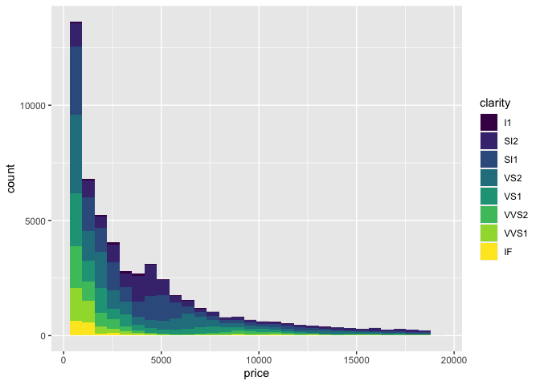
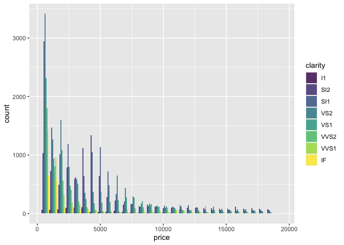
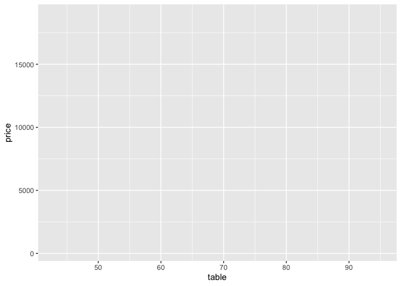

# ggplot basic

## Load `ggplot2` library as a part of `tidyverse`

```r
library(tidyverse)
```

```
## ─ Attaching packages ──────────────────── tidyverse 1.3.0 ─
```

```
## ✓ ggplot2 3.3.2     ✓ purrr   0.3.4
## ✓ tibble  3.0.4     ✓ dplyr   1.0.2
## ✓ tidyr   1.1.2     ✓ stringr 1.4.0
## ✓ readr   1.4.0     ✓ forcats 0.5.0
```

```
## Warning: package 'ggplot2' was built under R version 3.6.2
```

```
## Warning: package 'tibble' was built under R version 3.6.2
```

```
## Warning: package 'tidyr' was built under R version 3.6.2
```

```
## Warning: package 'readr' was built under R version 3.6.2
```

```
## Warning: package 'purrr' was built under R version 3.6.2
```

```
## Warning: package 'dplyr' was built under R version 3.6.2
```

```
## ─ Conflicts ───────────────────── tidyverse_conflicts() ─
## x dplyr::filter() masks stats::filter()
## x dplyr::lag()    masks stats::lag()
```

## Example data table

```r
diamonds %>% head
```

```
## # A tibble: 6 x 10
##   carat cut       color clarity depth table price     x     y     z
##   <dbl> <ord>     <ord> <ord>   <dbl> <dbl> <int> <dbl> <dbl> <dbl>
## 1 0.23  Ideal     E     SI2      61.5    55   326  3.95  3.98  2.43
## 2 0.21  Premium   E     SI1      59.8    61   326  3.89  3.84  2.31
## 3 0.23  Good      E     VS1      56.9    65   327  4.05  4.07  2.31
## 4 0.290 Premium   I     VS2      62.4    58   334  4.2   4.23  2.63
## 5 0.31  Good      J     SI2      63.3    58   335  4.34  4.35  2.75
## 6 0.24  Very Good J     VVS2     62.8    57   336  3.94  3.96  2.48
```

## `ggplot` function

- First argument: data frame
- Second argument: `aes()`


```r
ggplot(diamonds, aes())
```

<!-- -->

# With `x` in `aes()` in `ggplot()`


```r
ggplot(diamonds, aes(x=price))
```

<!-- -->

## `geom_hist()`: histogram


```r
ggplot(diamonds, aes(x=price)) + geom_histogram()
```

```
## `stat_bin()` using `bins = 30`. Pick better value with `binwidth`.
```

<!-- -->

### new line can be inserted after `+`


```r
ggplot(diamonds, aes(x=price)) +
  geom_histogram()
```

```
## `stat_bin()` using `bins = 30`. Pick better value with `binwidth`.
```

<!-- -->


### Grouping samples


```r
ggplot(diamonds, aes(x=price, fill=clarity)) +
  geom_histogram()
```

```
## `stat_bin()` using `bins = 30`. Pick better value with `binwidth`.
```

<!-- -->

### Grouping samples (independent histogram)


```r
ggplot(diamonds, aes(x=price, fill=clarity)) +
  geom_histogram(position = "identity", alpha = 0.8)
```

```
## `stat_bin()` using `bins = 30`. Pick better value with `binwidth`.
```

<!-- -->

### Grouping samples (dodged histogram)


```r
ggplot(diamonds, aes(x=price, fill=clarity)) +
  geom_histogram(position = "dodge", alpha = 0.8)
```

```
## `stat_bin()` using `bins = 30`. Pick better value with `binwidth`.
```

<!-- -->

## `geom_density()`: density plot


```r
ggplot(diamonds, aes(x=price)) +
  geom_density()
```

<!-- -->

# With `x` and `y` in `aes()` in `ggplot()`


```r
ggplot(diamonds, aes(x=table, y=price))
```

<!-- -->

## `geom_point`: Scatter plot


```r
ggplot(diamonds, aes(x=table, y=price)) + 
  geom_point()
```

<!-- -->

### Change size of points in scatter plot


```r
ggplot(diamonds, aes(x=table, y=price)) + 
  geom_point(size = 0.5)
```

<!-- -->

## `geom_smooth`: Draw smoothed line


```r
ggplot(diamonds, aes(x=depth, y=price)) + 
  geom_smooth()
```

```
## `geom_smooth()` using method = 'gam' and formula 'y ~ s(x, bs = "cs")'
```

<!-- -->

### `geom_point()` + `geom_smooth`


```r
ggplot(diamonds, aes(x=table, y=price)) + 
  geom_point(size = 0.5) +
  geom_smooth()
```

```
## `geom_smooth()` using method = 'gam' and formula 'y ~ s(x, bs = "cs")'
```

<!-- -->


## `geom_bin2d()`


```r
ggplot(diamonds, aes(x=table, y=price)) + 
  geom_bin2d()
```

<!-- -->

## `geom_boxplot()`: box plot


```r
ggplot(diamonds, aes(x=clarity, y=price)) + 
  geom_boxplot()
```

<!-- -->

## `geom_violin()`: violin plot


```r
ggplot(diamonds, aes(x=clarity, y=price)) + 
  geom_violin()
```

<!-- -->


# sessionInfo()


```r
sessionInfo()
```

```
## R version 3.6.1 (2019-07-05)
## Platform: x86_64-apple-darwin15.6.0 (64-bit)
## Running under: macOS Mojave 10.14.6
## 
## Matrix products: default
## BLAS:   /Library/Frameworks/R.framework/Versions/3.6/Resources/lib/libRblas.0.dylib
## LAPACK: /Library/Frameworks/R.framework/Versions/3.6/Resources/lib/libRlapack.dylib
## 
## locale:
## [1] ja_JP.UTF-8/ja_JP.UTF-8/ja_JP.UTF-8/C/ja_JP.UTF-8/ja_JP.UTF-8
## 
## attached base packages:
## [1] stats     graphics  grDevices utils     datasets  methods   base     
## 
## other attached packages:
## [1] forcats_0.5.0   stringr_1.4.0   dplyr_1.0.2     purrr_0.3.4    
## [5] readr_1.4.0     tidyr_1.1.2     tibble_3.0.4    ggplot2_3.3.2  
## [9] tidyverse_1.3.0
## 
## loaded via a namespace (and not attached):
##  [1] tidyselect_1.1.0  xfun_0.19         lattice_0.20-41   splines_3.6.1    
##  [5] haven_2.3.1       colorspace_2.0-0  vctrs_0.3.6       generics_0.1.0   
##  [9] viridisLite_0.3.0 htmltools_0.5.0   mgcv_1.8-33       yaml_2.2.1       
## [13] utf8_1.1.4        rlang_0.4.9       pillar_1.4.7      glue_1.4.2       
## [17] withr_2.3.0       DBI_1.1.0         dbplyr_2.0.0      modelr_0.1.8     
## [21] readxl_1.3.1      lifecycle_0.2.0   munsell_0.5.0     gtable_0.3.0     
## [25] cellranger_1.1.0  rvest_0.3.6       evaluate_0.14     labeling_0.4.2   
## [29] knitr_1.30        fansi_0.4.1       broom_0.7.3       Rcpp_1.0.5       
## [33] scales_1.1.1      backports_1.2.1   jsonlite_1.7.2    farver_2.0.3     
## [37] fs_1.5.0          hms_0.5.3         digest_0.6.27     stringi_1.5.3    
## [41] grid_3.6.1        cli_2.2.0         tools_3.6.1       magrittr_2.0.1   
## [45] crayon_1.3.4      pkgconfig_2.0.3   Matrix_1.2-18     ellipsis_0.3.1   
## [49] xml2_1.3.2        reprex_0.3.0      lubridate_1.7.9.2 assertthat_0.2.1 
## [53] rmarkdown_2.6     httr_1.4.2        rstudioapi_0.13   R6_2.5.0         
## [57] nlme_3.1-151      compiler_3.6.1
```
