# Basics

## Load `ggplot2` and `cowplot` libraries as a part of `tidyverse`

```r
library(tidyverse)
```

```
## ─ Attaching packages ──────────────────── tidyverse 1.3.0 ─
```

```
## ✓ ggplot2 3.3.2     ✓ purrr   0.3.4
## ✓ tibble  3.0.4     ✓ dplyr   1.0.2
## ✓ tidyr   1.1.2     ✓ stringr 1.4.0
## ✓ readr   1.4.0     ✓ forcats 0.5.0
```

```
## Warning: package 'ggplot2' was built under R version 3.6.2
```

```
## Warning: package 'tibble' was built under R version 3.6.2
```

```
## Warning: package 'tidyr' was built under R version 3.6.2
```

```
## Warning: package 'readr' was built under R version 3.6.2
```

```
## Warning: package 'purrr' was built under R version 3.6.2
```

```
## Warning: package 'dplyr' was built under R version 3.6.2
```

```
## ─ Conflicts ───────────────────── tidyverse_conflicts() ─
## x dplyr::filter() masks stats::filter()
## x dplyr::lag()    masks stats::lag()
```

```r
library(cowplot)
```

```
## Warning: package 'cowplot' was built under R version 3.6.2
```

## Example data table

```r
iris %>% head
```

```
##   Sepal.Length Sepal.Width Petal.Length Petal.Width Species
## 1          5.1         3.5          1.4         0.2  setosa
## 2          4.9         3.0          1.4         0.2  setosa
## 3          4.7         3.2          1.3         0.2  setosa
## 4          4.6         3.1          1.5         0.2  setosa
## 5          5.0         3.6          1.4         0.2  setosa
## 6          5.4         3.9          1.7         0.4  setosa
```

# example plot

```r
ggplot(iris, aes(x = Species, y = Sepal.Length)) +
  geom_boxplot() + theme_bw() +
  theme(axis.text.x = element_text(size = 14, angle = 90, vjust = 0.5))
```

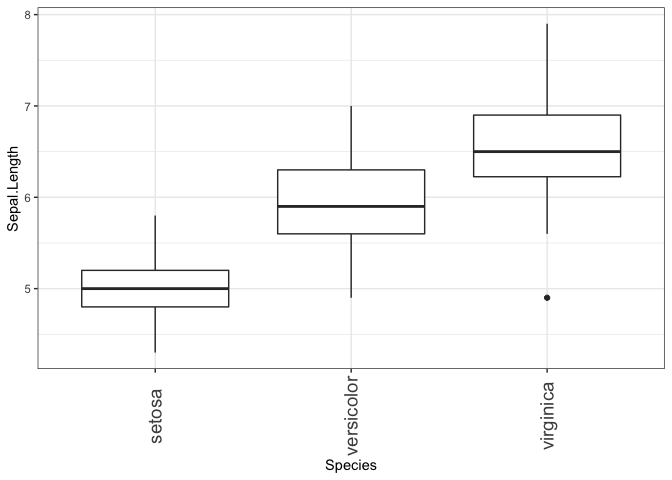<!-- -->

## plot can be assigned to an object


```r
p1 <- ggplot(iris, aes(x = Species, y = Sepal.Length)) +
  geom_boxplot() + theme_bw() +
  theme(axis.text.x = element_text(size = 14, angle = 90, vjust = 0.5))
```

# Example plot 2


```r
ggplot(iris, aes(x = Sepal.Length, fill = Species)) +
  geom_density(alpha = 0.7) + theme_bw() +
  theme(legend.position = c(0.8, 0.8))
```

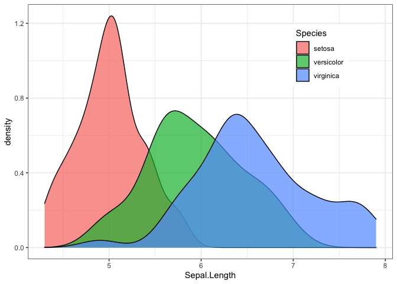<!-- -->

## plot can be assigned to an object


```r
p2 <- ggplot(iris, aes(x = Sepal.Length, fill = Species)) +
  geom_density(alpha = 0.7) + theme_bw() +
  theme(legend.position = c(0.8, 0.8))
```

# `plot_grid()`


```r
plot_grid(p1, p2)
```

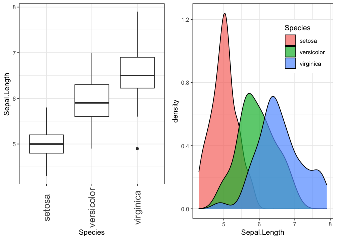<!-- -->

## `labels` option in  `plot_grid()`


```r
plot_grid(p1, p2, labels = "AUTO")
```

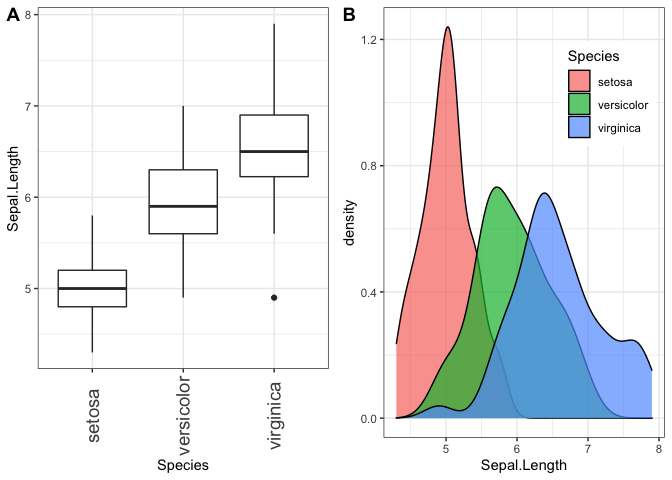<!-- -->


```r
plot_grid(p1, p2, labels = "auto")
```

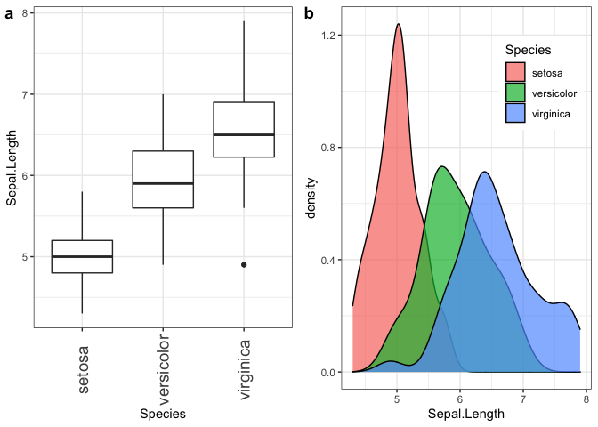<!-- -->


```r
plot_grid(p1, p2, labels = c("A1", "A2"))
```

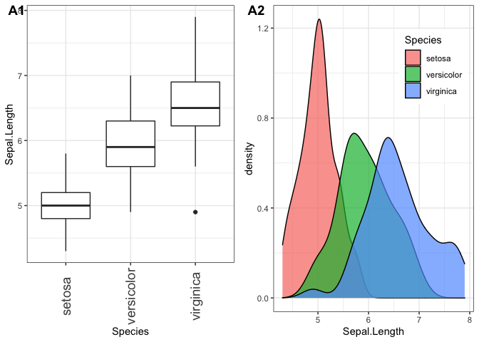<!-- -->


## `align` option in `plot_grid()`


```r
plot_grid(p1, p2, labels = "AUTO")
```

<!-- -->


```r
plot_grid(p1, p2, labels = "AUTO", align = "h")
```

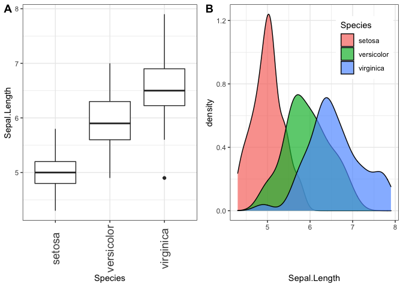<!-- -->

## label settings


```r
plot_grid(p1, p2, labels = "AUTO", align = "h",
          label_size = 10,
          label_fontfamily = "serif",
          label_fontface = "plain",
          label_colour = "blue")
```

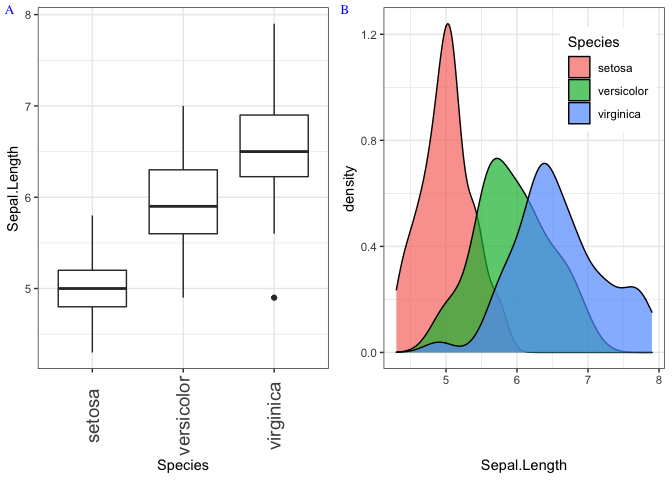<!-- -->

## `ncol` option


```r
plot_grid(p1, p2, labels = "AUTO", ncol = 1)
```

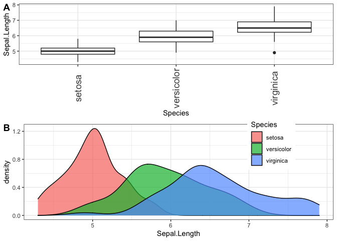<!-- -->

## `rel_widths` option


```r
plot_grid(p1, p2, labels = "AUTO", rel_widths = c(1, 2))
```

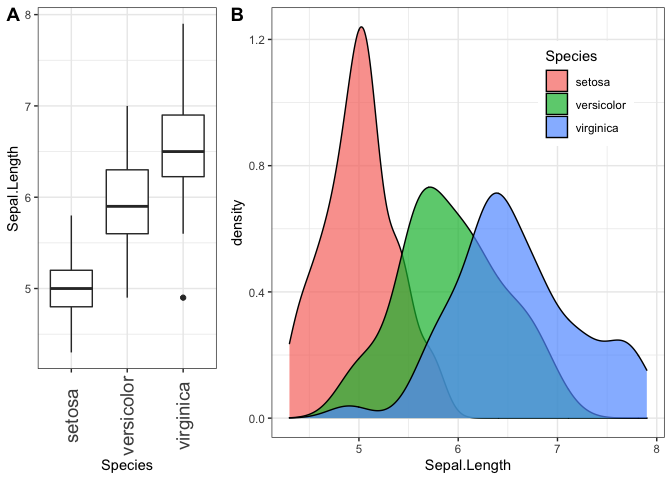<!-- -->


## Complex layout


```r
plot_grid(
  p1, NULL, NULL, p2,
  labels = "AUTO", ncol = 2
)
```

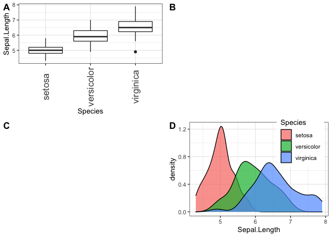<!-- -->

# Nested plot grids


```r
bottom_row <- plot_grid(p1, p2, labels = c('B', 'C'), label_size = 12)
p3 <- ggplot(mtcars, aes(x = qsec, y = disp)) + geom_point() + facet_wrap(~gear)

plot_grid(p3, bottom_row, labels = c('A', ''), label_size = 12, ncol = 1)
```

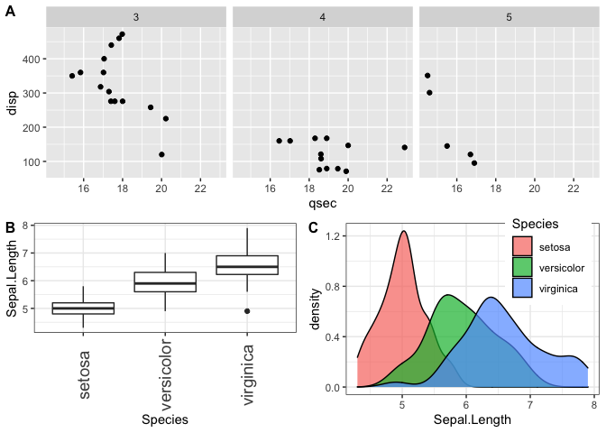<!-- -->

## `align_plots()`


```r
plots <- align_plots(p3, p1, align = 'v', axis = 'l')
# then build the bottom row
bottom_row <- plot_grid(plots[[2]], p2, labels = c('B', 'C'), label_size = 12)

# then combine with the top row for final plot
plot_grid(plots[[1]], bottom_row, labels = c('A', ''), label_size = 12, ncol = 1)
```

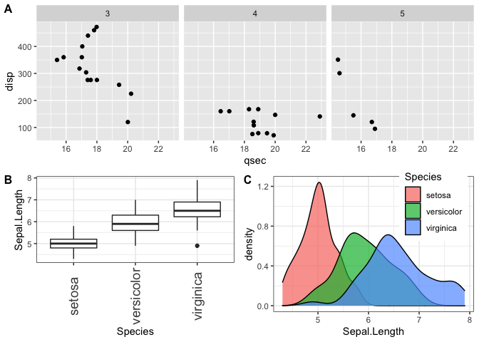<!-- -->


# Joint plot titles


```r
# now add the title
plot_row <- plot_grid(p1, p2)

title <- ggdraw() + 
  draw_label(
    "Miles per gallon decline with displacement and horsepower",
    fontface = 'bold',
    x = 0,
    hjust = 0
  ) +
  theme(
    # add margin on the left of the drawing canvas,
    # so title is aligned with left edge of first plot
    plot.margin = margin(0, 0, 0, 7)
  )
plot_grid(
  title, plot_row,
  ncol = 1,
  # rel_heights values control vertical title margins
  rel_heights = c(0.1, 1)
)
```

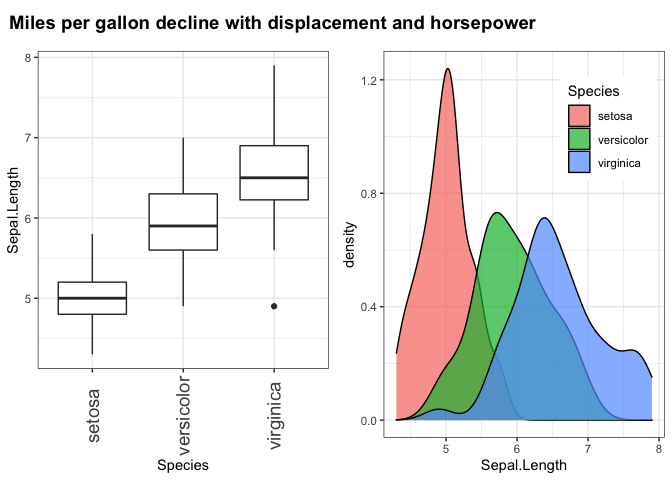<!-- -->

# sessionInfo()


```r
sessionInfo()
```

```
## R version 3.6.1 (2019-07-05)
## Platform: x86_64-apple-darwin15.6.0 (64-bit)
## Running under: macOS Mojave 10.14.6
## 
## Matrix products: default
## BLAS:   /Library/Frameworks/R.framework/Versions/3.6/Resources/lib/libRblas.0.dylib
## LAPACK: /Library/Frameworks/R.framework/Versions/3.6/Resources/lib/libRlapack.dylib
## 
## locale:
## [1] ja_JP.UTF-8/ja_JP.UTF-8/ja_JP.UTF-8/C/ja_JP.UTF-8/ja_JP.UTF-8
## 
## attached base packages:
## [1] stats     graphics  grDevices utils     datasets  methods   base     
## 
## other attached packages:
##  [1] cowplot_1.1.0   forcats_0.5.0   stringr_1.4.0   dplyr_1.0.2    
##  [5] purrr_0.3.4     readr_1.4.0     tidyr_1.1.2     tibble_3.0.4   
##  [9] ggplot2_3.3.2   tidyverse_1.3.0
## 
## loaded via a namespace (and not attached):
##  [1] tidyselect_1.1.0  xfun_0.19         haven_2.3.1       colorspace_2.0-0 
##  [5] vctrs_0.3.6       generics_0.1.0    htmltools_0.5.0   yaml_2.2.1       
##  [9] rlang_0.4.9       pillar_1.4.7      glue_1.4.2        withr_2.3.0      
## [13] DBI_1.1.0         dbplyr_2.0.0      modelr_0.1.8      readxl_1.3.1     
## [17] lifecycle_0.2.0   munsell_0.5.0     gtable_0.3.0      cellranger_1.1.0 
## [21] rvest_0.3.6       evaluate_0.14     labeling_0.4.2    knitr_1.30       
## [25] fansi_0.4.1       broom_0.7.3       Rcpp_1.0.5        scales_1.1.1     
## [29] backports_1.2.1   jsonlite_1.7.2    farver_2.0.3      fs_1.5.0         
## [33] hms_0.5.3         digest_0.6.27     stringi_1.5.3     grid_3.6.1       
## [37] cli_2.2.0         tools_3.6.1       magrittr_2.0.1    crayon_1.3.4     
## [41] pkgconfig_2.0.3   ellipsis_0.3.1    xml2_1.3.2        reprex_0.3.0     
## [45] lubridate_1.7.9.2 assertthat_0.2.1  rmarkdown_2.6     httr_1.4.2       
## [49] rstudioapi_0.13   R6_2.5.0          compiler_3.6.1
```

# References

- https://wilkelab.org/cowplot/articles/plot_grid.html
