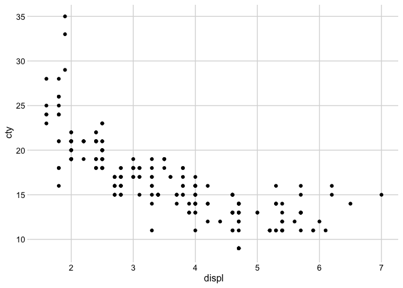
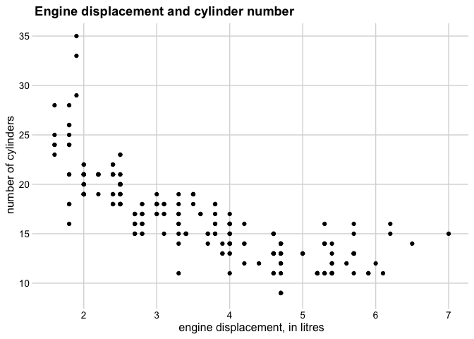
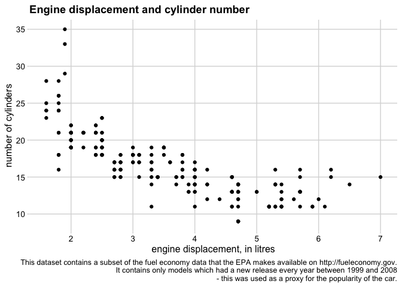
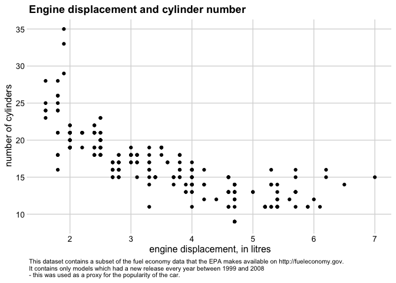
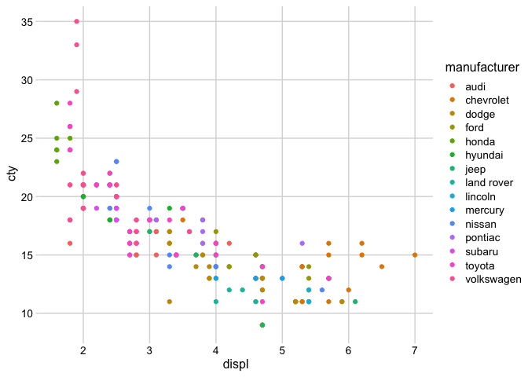
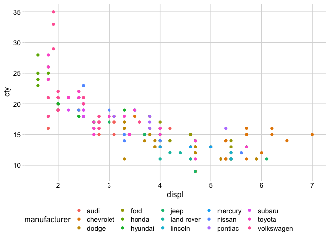
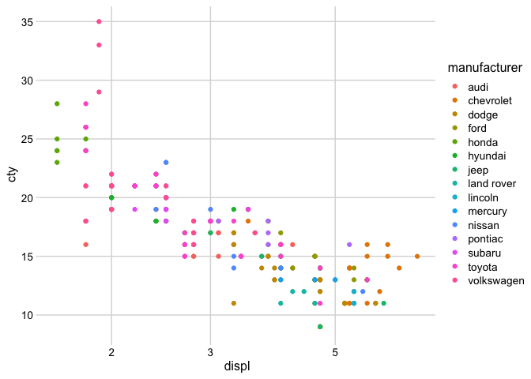
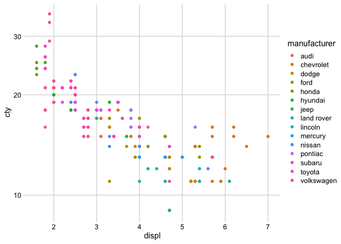

## Load `ggplot2` and `cowplot` libraries as a part of `tidyverse`


```r
library(tidyverse)
```

```
## ─ Attaching packages ──────────────────── tidyverse 1.3.0 ─
```

```
## ✓ ggplot2 3.3.2     ✓ purrr   0.3.4
## ✓ tibble  3.0.4     ✓ dplyr   1.0.2
## ✓ tidyr   1.1.2     ✓ stringr 1.4.0
## ✓ readr   1.4.0     ✓ forcats 0.5.0
```

```
## Warning: package 'ggplot2' was built under R version 3.6.2
```

```
## Warning: package 'tibble' was built under R version 3.6.2
```

```
## Warning: package 'tidyr' was built under R version 3.6.2
```

```
## Warning: package 'readr' was built under R version 3.6.2
```

```
## Warning: package 'purrr' was built under R version 3.6.2
```

```
## Warning: package 'dplyr' was built under R version 3.6.2
```

```
## ─ Conflicts ───────────────────── tidyverse_conflicts() ─
## x dplyr::filter() masks stats::filter()
## x dplyr::lag()    masks stats::lag()
```

```r
library(cowplot)
```

```
## Warning: package 'cowplot' was built under R version 3.6.2
```

## Example data table

```r
mpg %>% head
```

```
## # A tibble: 6 x 11
##   manufacturer model displ  year   cyl trans      drv     cty   hwy fl    class 
##   <chr>        <chr> <dbl> <int> <int> <chr>      <chr> <int> <int> <chr> <chr> 
## 1 audi         a4      1.8  1999     4 auto(l5)   f        18    29 p     compa…
## 2 audi         a4      1.8  1999     4 manual(m5) f        21    29 p     compa…
## 3 audi         a4      2    2008     4 manual(m6) f        20    31 p     compa…
## 4 audi         a4      2    2008     4 auto(av)   f        21    30 p     compa…
## 5 audi         a4      2.8  1999     6 auto(l5)   f        16    26 p     compa…
## 6 audi         a4      2.8  1999     6 manual(m5) f        18    26 p     compa…
```


# `labs()`


```r
p <- ggplot(mpg, aes(displ, cty)) +
  geom_point() +
  theme_minimal_grid(12)

p
```

<!-- -->

## Title, x- and y-axis labels


```r
p + labs(
  title = "Engine displacement and cylinder number ", 
  x = "engine displacement, in litres",
  y = "number of cylinders"
  )
```

<!-- -->

## Caption


```r
p + labs(
  title = "Engine displacement and cylinder number ", 
  x = "engine displacement, in litres",
  y = "number of cylinders",
  caption = "This dataset contains a subset of the fuel economy data that the EPA makes available on http://fueleconomy.gov.
It contains only models which had a new release every year between 1999 and 2008
- this was used as a proxy for the popularity of the car."
  )
```

<!-- -->

# `theme()`

See https://ggplot2.tidyverse.org/reference/theme.html

## Modify caption text


```r
p + labs(
  title = "Engine displacement and cylinder number ", 
  x = "engine displacement, in litres",
  y = "number of cylinders",
  caption = "This dataset contains a subset of the fuel economy data that the EPA makes available on http://fueleconomy.gov.
It contains only models which had a new release every year between 1999 and 2008
- this was used as a proxy for the popularity of the car."
  ) +
  theme(plot.caption = element_text(hjust=0, size=8))
```

<!-- -->


## Modify legend 


```r
p <- ggplot(mpg, aes(displ, cty, color=manufacturer)) +
  geom_point() +
  theme_minimal_grid(12)

p
```

<!-- -->


```r
p + theme(legend.position = "bottom")
```

<!-- -->

# scale


```r
p
```

<!-- -->

## scale axis into log10


```r
p + scale_x_log10()
```

<!-- -->


```r
p + scale_y_log10()
```

<!-- -->


# `ggsave()`

## PDF


```r
ggsave("plot.pdf", plot=p)
```

```
## Saving 7 x 5 in image
```

## SVG


```r
ggsave("plot.svg", plot=p)
```

```
## Saving 7 x 5 in image
```

```
## Warning: package 'gdtools' was built under R version 3.6.2
```

## PNG


```r
ggsave("plot.png", plot=p)
```

```
## Saving 7 x 5 in image
```

# sessionInfo()


```r
sessionInfo()
```

```
## R version 3.6.1 (2019-07-05)
## Platform: x86_64-apple-darwin15.6.0 (64-bit)
## Running under: macOS Mojave 10.14.6
## 
## Matrix products: default
## BLAS:   /Library/Frameworks/R.framework/Versions/3.6/Resources/lib/libRblas.0.dylib
## LAPACK: /Library/Frameworks/R.framework/Versions/3.6/Resources/lib/libRlapack.dylib
## 
## locale:
## [1] ja_JP.UTF-8/ja_JP.UTF-8/ja_JP.UTF-8/C/ja_JP.UTF-8/ja_JP.UTF-8
## 
## attached base packages:
## [1] stats     graphics  grDevices utils     datasets  methods   base     
## 
## other attached packages:
##  [1] gdtools_0.2.2   cowplot_1.1.0   forcats_0.5.0   stringr_1.4.0  
##  [5] dplyr_1.0.2     purrr_0.3.4     readr_1.4.0     tidyr_1.1.2    
##  [9] tibble_3.0.4    ggplot2_3.3.2   tidyverse_1.3.0
## 
## loaded via a namespace (and not attached):
##  [1] tidyselect_1.1.0  xfun_0.19         haven_2.3.1       colorspace_2.0-0 
##  [5] vctrs_0.3.6       generics_0.1.0    htmltools_0.5.0   yaml_2.2.1       
##  [9] utf8_1.1.4        rlang_0.4.9       pillar_1.4.7      glue_1.4.2       
## [13] withr_2.3.0       DBI_1.1.0         dbplyr_2.0.0      modelr_0.1.8     
## [17] readxl_1.3.1      lifecycle_0.2.0   munsell_0.5.0     gtable_0.3.0     
## [21] cellranger_1.1.0  rvest_0.3.6       evaluate_0.14     labeling_0.4.2   
## [25] knitr_1.30        fansi_0.4.1       broom_0.7.3       Rcpp_1.0.5       
## [29] scales_1.1.1      backports_1.2.1   jsonlite_1.7.2    systemfonts_0.3.2
## [33] farver_2.0.3      fs_1.5.0          hms_0.5.3         digest_0.6.27    
## [37] stringi_1.5.3     grid_3.6.1        cli_2.2.0         tools_3.6.1      
## [41] magrittr_2.0.1    crayon_1.3.4      pkgconfig_2.0.3   ellipsis_0.3.1   
## [45] xml2_1.3.2        reprex_0.3.0      lubridate_1.7.9.2 svglite_1.2.3.2  
## [49] assertthat_0.2.1  rmarkdown_2.6     httr_1.4.2        rstudioapi_0.13  
## [53] R6_2.5.0          compiler_3.6.1
```
