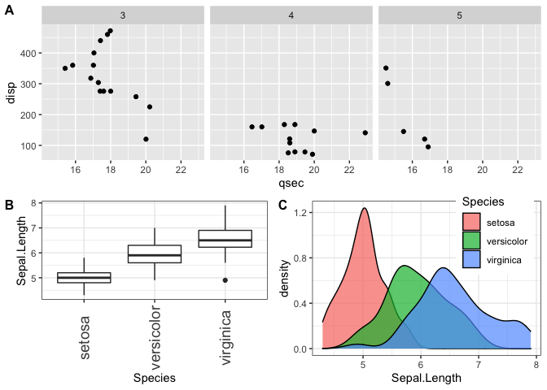

# 2021_tutorial_ggplot2

## Examples of plots today

<!-- -->

<!-- -->

<!-- -->

<!-- -->

## Contents

1. [ggplot2 basics](01_ggplot2_basic.md)
1. [Faceting](02_facet.md)
1. [Align data using `plot_grid()`](03_plot_grid.md)
1. [Other fuction](04_others.md)

## Futher reading

- ggplot2 reference https://ggplot2.tidyverse.org/reference/index.html
- cowplot https://wilkelab.org/cowplot/articles/introduction.html
- Other ggplot2-related ecosystems
  - `GGally` https://ggobi.github.io/ggally/
  - `egg` https://cran.r-project.org/web/packages/egg/vignettes/Ecosystem.html
  - `patchwork` https://patchwork.data-imaginist.com/articles/guides/assembly.html
  - `ggpubr` https://rpkgs.datanovia.com/ggpubr/index.html
  - `ggrepel` https://ggrepel.slowkow.com/articles/examples.html
